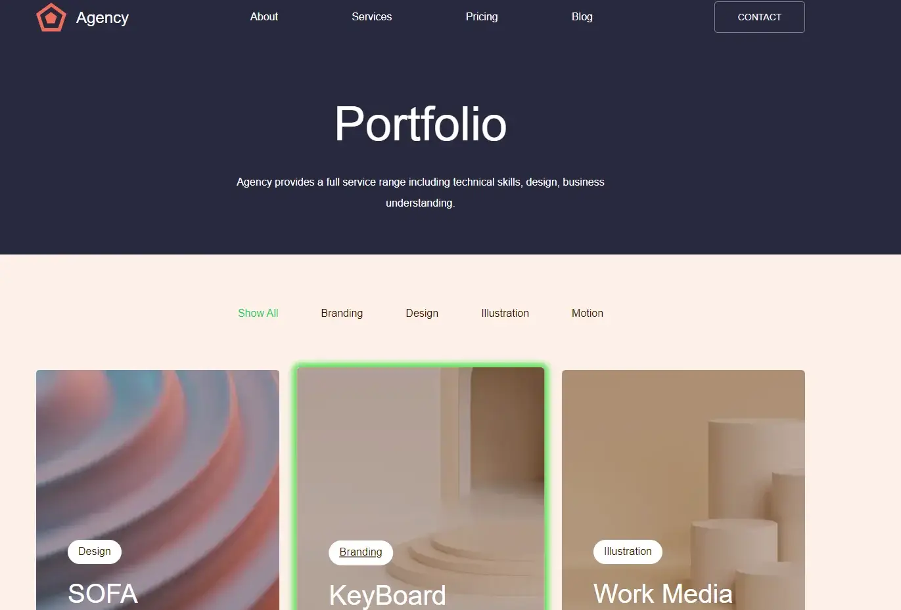

# Проект: Agency 
[Ссылка на проект в GH Pages](https://dariy-iva.github.io/agency/)  

## О проекте

Проект подготовлен для наполнения портфолио. Представляет собой веб-страницу с набором карточек.

### Реализовано  
Верстка:  
✔ резиново-адаптивная верстка для десктопа и мобильной версии (мобильная версия отображается при ширине экрана менее 1040px)  
✔ каркас сайта и сетка карточек построены на Flexbox  
✔ в десктопном варианте первоначально отображается 9 карточек, в мобильной версии - 8  
✔ при выборе карточки включается её подсветка  
✔ эффекты наведения присутствуют на всех интерактивных элементах  

Интерактивность:  
✔ доступен выбор категории карточек (при выборе категории отображаются только карточки ей соответствующие, при выборе Show All отображаются все карточки) - действует при нажатии на категорию как в меню, так и внутри самой карточки    
✔ нажатие на кнопку Load more подгружает следующий набор карточек (при отсутствии карточек кнопка скрывается)  
✔ доступны выбор/снятие выбора при клике по карточке  
✔ при нажатии на кнопку Delete все выбранные карточки удалаются (повторно при фильтрации по категории не появляются)  
✔ при переходе по несуществующему пути отображается страница с ошибкой и возможностью вернуться назад (подключен React Router)  
✔ количество подгружаемых карточек меняется в зависимости от размера экрана интерактивно (в т.ч. при смене ориентации экрана, подключен кастомный хук useWindowSize) 

Хранение данных:  
✔ первоначальные данные карточек берутся из коробки, хранятся и меняются внутри хранилища (подключен Redux)

### Стек:
* HTML (JSX)
* CSS
* React
* Redux  

## Директории

`/components` — папка с компонентами приложения (внутри каждой папки хранятся файлы JSX и CSS, относящиеся к компоненту)  
`/images` — папка с изображениями  
`/utils` - папка с файлами констант и настроек конфигурации  
`/vendor` - папка с кодом и файлами сторонних разработчиков (включая шрифты)  

## Установка зависимостей и запуск проекта

##### `npm i` – установить зависимости

##### `npm run start` – запуск devServer на localhost

##### `npm run build` – production сборка проекта
